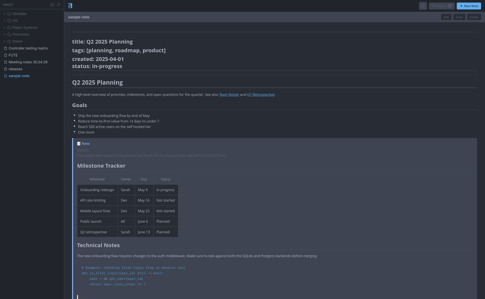
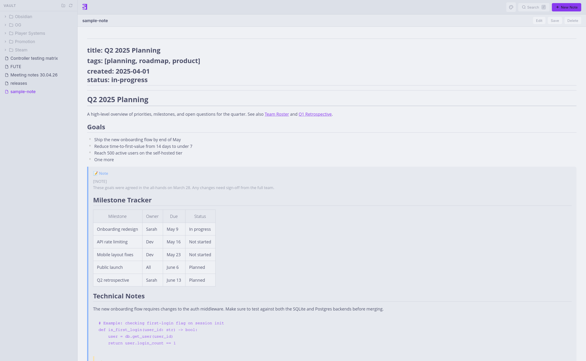

<p align="center">
  
</p>

A self-hosted Docker web interface for [Obsidian](https://obsidian.md) vaults. Browse and edit your markdown notes in a browser with a full WYSIWYG editor, hierarchical folder navigation, and Obsidian-flavored markdown rendering.




## Features

- **WYSIWYG editor** — Toggle between rich editing and raw markdown via [Toast UI Editor](https://github.com/nhn/tui.editor)
- **Hierarchical file tree** — Navigate nested vault folders; `.obsidian/` and hidden directories are automatically excluded
- **Obsidian markdown support** — Callouts (`> [!NOTE]`), wikilinks (`[[Note Name]]`), frontmatter display, `#tags`
- **Full-text search** — Instant search across all notes powered by Whoosh
- **Auto-save** — Debounced 1.5s auto-save while editing; Ctrl+S for immediate save
- **Keyboard shortcuts** — `/` to search, `Ctrl+Alt+N` for new note, `Ctrl+E` to toggle edit/preview
- **Read-only mode** — Mount your vault read-only for safe browsing
- **Docker-native** — Multi-stage build, PUID/PGID support, health check endpoint

## Quick Start

### Docker Compose (recommended)

1. Clone the repo and edit `docker-compose.yml` to point to your vault:

```yaml
volumes:
  - /path/to/your/obsidian/vault:/vault:rw
```

2. Start the container:

```bash
docker compose up --build -d
```

3. Open [http://localhost:5147](http://localhost:5147)

### Portainer Stack

1. In Portainer, go to **Stacks → Add stack**
2. Choose **Repository** as the build method and fill in:
   - **Repository URL:** `https://github.com/foofly/slate`
   - **Repository reference:** `refs/heads/main`
   - **Compose path:** `docker-compose.yml`
3. Under **Environment variables**, set at minimum:
   - `SLATE_VAULT_PATH` — path to your vault on the host (e.g. `/home/user/obsidian`)
4. Click **Deploy the stack**

To auto-redeploy when you push to GitHub, enable **GitOps updates** in the stack settings and set a polling interval.

### Docker CLI

```bash
docker build -t slate .
docker run -d \
  -p 5147:5147 \
  -v /path/to/your/obsidian/vault:/vault:rw \
  -e PUID=1000 -e PGID=1000 \
  --name slate \
  slate
```

## Configuration

All configuration is via environment variables:

| Variable | Default | Description |
|---|---|---|
| `SLATE_VAULT_PATH` | `/vault` | Path to the vault directory inside the container |
| `SLATE_HOST` | `0.0.0.0` | Bind host |
| `SLATE_PORT` | `5147` | Bind port |
| `SLATE_READONLY` | `false` | Set to `true` to disable all write operations |
| `PUID` | `1000` | User ID for vault file ownership (when running as root) |
| `PGID` | `1000` | Group ID for vault file ownership |

### Read-only mode

```yaml
volumes:
  - /path/to/vault:/vault:ro
environment:
  SLATE_READONLY: "true"
```

## Development

**Requirements:** Node.js 20+, Python 3.11+

```bash
# Install frontend dependencies
npm install

# Install backend dependencies
pip install -r server/requirements.txt

# Terminal 1 — backend (hot reload)
SLATE_VAULT_PATH=/path/to/your/vault uvicorn server.main:app --reload --port 8000

# Terminal 2 — frontend dev server (proxies /api to :8000)
npm run dev
# → http://localhost:5173
```

### Build frontend for production

```bash
npm run build
# Output: client/dist/
```

## Project Structure

```
slate/
├── Dockerfile
├── docker-compose.yml
├── package.json
├── vite.config.js
├── tailwind.config.js
├── client/                     # Vue 3 SPA
│   ├── index.js                # App entry point
│   ├── App.vue                 # Root layout
│   ├── store.js                # Pinia state (vault tree, active note)
│   ├── router.js               # Vue Router
│   ├── api.js                  # API client (Axios)
│   ├── helpers.js              # Path utilities, debounce
│   ├── components/
│   │   ├── FileTree.vue        # Sidebar folder tree
│   │   ├── TreeNode.vue        # Recursive tree node
│   │   ├── SearchModal.vue     # Full-text search overlay
│   │   ├── NewNoteModal.vue    # Create note dialog
│   │   └── toastui/            # Toast UI Editor wrappers + Obsidian plugin
│   └── views/
│       ├── NoteEditor.vue      # Main editor view
│       └── Welcome.vue         # Empty state
└── server/                     # FastAPI backend
    ├── main.py                 # Routes
    ├── vault.py                # Filesystem operations
    ├── search.py               # Whoosh full-text index
    ├── helpers.py              # Path sanitization (security)
    ├── models.py               # Pydantic schemas
    └── config.py               # Environment config
```

## API

| Method | Endpoint | Description |
|---|---|---|
| `GET` | `/api/tree` | Full vault folder/file tree |
| `GET` | `/api/notes/{path}` | Read a note |
| `PUT` | `/api/notes/{path}` | Save a note |
| `POST` | `/api/notes/{path}` | Create a note |
| `DELETE` | `/api/notes/{path}` | Delete a note |
| `PATCH` | `/api/notes/{path}` | Rename/move a note |
| `GET` | `/api/search?q=…` | Full-text search |
| `GET` | `/health` | Health check |

## Keyboard Shortcuts

| Shortcut | Action |
|---|---|
| `/` | Open search |
| `Ctrl+Alt+N` | New note |
| `Ctrl+S` | Save current note |
| `Ctrl+E` | Toggle edit / preview |
| `Escape` | Close modal |

## Obsidian Syntax Support

| Feature | Supported |
|---|---|
| Callouts `> [!NOTE]`, `> [!WARNING]`, etc. | ✅ |
| Wikilinks `[[Note Name]]` | ✅ |
| Frontmatter YAML | ✅ |
| Tags `#tag` | ✅ |
| Code blocks with syntax highlighting | ✅ |
| Standard markdown (headings, tables, lists…) | ✅ |
| Backlinks / graph view | ❌ |
| Embedded images (`![[image.png]]`) | ✅ |

## Security

- All note paths are resolved and validated to stay within the vault root — path traversal attempts (`../../etc/passwd`) return HTTP 400
- Hidden directories (`.obsidian/`, `.git/`, etc.) are inaccessible via the API and excluded from the file tree
- Only `.md` files are readable/writable; requests for other file types are rejected
- Vault files are written atomically (write to `.tmp`, then rename) to prevent corruption on interrupted saves

## Stack

- **Backend:** Python 3.11, FastAPI, Uvicorn, Whoosh, aiofiles
- **Frontend:** Vue 3, Vite, Tailwind CSS, Pinia, Vue Router
- **Editor:** [Toast UI Editor v3](https://github.com/nhn/tui.editor) (MIT)

## Credits & Attributions

### Author

- **[foofly](https://github.com/foofly)** — creator and maintainer of Slate.

### Inspiration

- **[flatnotes](https://github.com/Dullage/flatnotes)** by [Adam Dullage](https://github.com/Dullage) — the architecture pattern (Vue 3 + FastAPI + Toast UI Editor served as a single Docker container) was directly inspired by this project. Licensed under MIT. Copyright © 2021 Adam Dullage.

### Frontend

- **[Toast UI Editor](https://github.com/nhn/tui.editor)** by NHN Cloud Corp. — the WYSIWYG/markdown editor at the core of the editing experience. Licensed under MIT. Copyright © 2020 NHN Cloud Corp.
- **[Vue.js](https://vuejs.org)** by Evan You — the progressive JavaScript framework powering the SPA. Licensed under MIT.
- **[Vite](https://vitejs.dev)** by VoidZero Inc. and Vite contributors — frontend build tool and dev server. Licensed under MIT.
- **[Pinia](https://pinia.vuejs.org)** by Eduardo San Martin Morote — Vue state management. Licensed under MIT.
- **[Vue Router](https://router.vuejs.org)** by Evan You — client-side routing. Licensed under MIT.
- **[Tailwind CSS](https://tailwindcss.com)** by Tailwind Labs, Inc. — utility-first CSS framework. Licensed under MIT.
- **[PrimeVue](https://primevue.org)** by PrimeTek — UI component library. Licensed under MIT.
- **[Axios](https://axios-http.com)** by Matt Zabriskie & Collaborators — HTTP client. Licensed under MIT.
- **[Mousetrap](https://craig.is/killing/mice)** by Craig Campbell — keyboard shortcut library. Licensed under Apache 2.0.
- **[Prism.js](https://prismjs.com)** by Lea Verou — syntax highlighting for code blocks. Licensed under MIT. Copyright © 2012 Lea Verou.

### Backend

- **[FastAPI](https://fastapi.tiangolo.com)** by Sebastián Ramírez — the web framework powering the REST API. Licensed under MIT.
- **[Uvicorn](https://www.uvicorn.org)** by Encode OSS Ltd. — ASGI server. Licensed under BSD 3-Clause. Copyright © 2017–present Encode OSS Ltd.
- **[Whoosh](https://github.com/mchaput/whoosh)** by Matt Chaput — pure-Python full-text search library. Licensed under BSD 2-Clause. Copyright © 2011 Matt Chaput.
- **[aiofiles](https://github.com/Tinche/aiofiles)** — async file I/O for Python. Licensed under Apache 2.0.
- **[Pydantic](https://docs.pydantic.dev)** by Pydantic Services Inc. and individual contributors — data validation. Licensed under MIT.
- **[PyYAML](https://pyyaml.org)** — YAML parsing for frontmatter. Licensed under MIT.

### Fonts

- **[Inter](https://rsms.me/inter/)** by Rasmus Andersson — UI typeface. Licensed under SIL Open Font License 1.1.

---

> Slate is not affiliated with or endorsed by [Obsidian](https://obsidian.md). Obsidian is a trademark of Obsidian MD Inc.

## License

MIT
